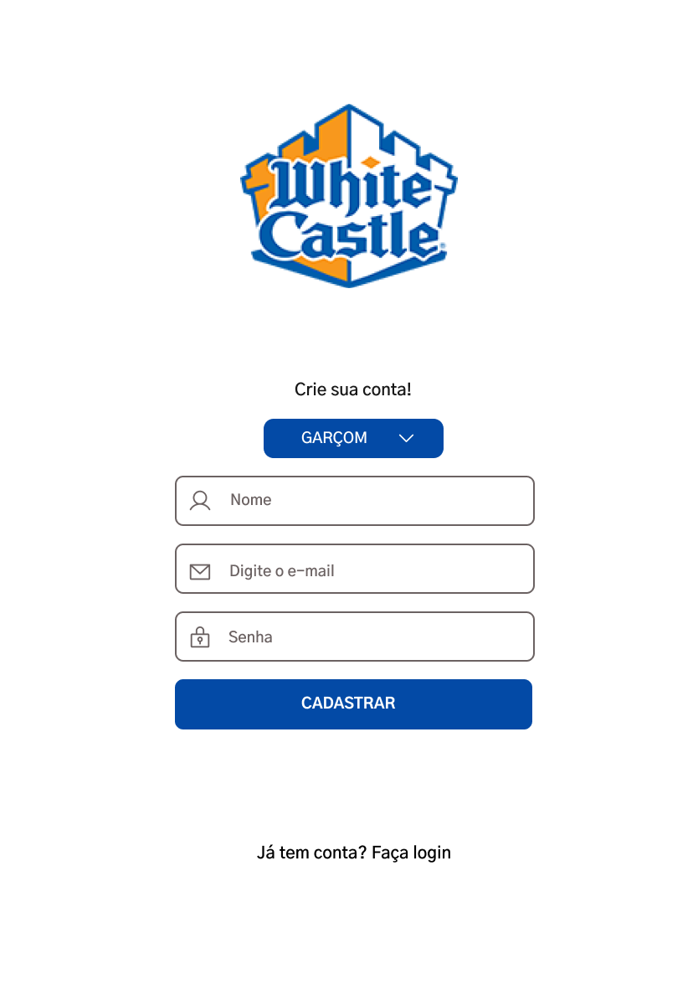

# White Castle - projeto Burguer Queen (API Client)

## Índice

* [1. Prefácio](#1-prefácio)
* [2. Resumo do projeto](#2-resumo-do-projeto)
* [3. Protótipo](#3-prototipo)
* [4. Considerações gerais](#4-considerações-gerais)
* [5. Critérios de aceitação mínimos do projeto](#5-critérios-mínimos-de-aceitação-do-projeto)

***

## 1. Prefácio
### 1.1 Produto 
 White Castle é uma rede de hamburgueria e considerara uma das pioneiras no ramo de *fast food*, e está em espação nacional e para atender de forma rápida e eficiente seus clientes, foi desenvolvida uma comanda de uso interno para os garçons e cozinheiros,e assim conseguirem administrar os pedidos, envio para cozinha, tempo de preparo e entrega.

Segundo o Dev Média: "Single Page Applications (SPA) são aplicações cuja funcionalidade está concentrada em uma única página. Ao invés de recarregar toda a página ou redirecionar o usuário para uma página nova, apenas o conteúdo principal é atualizado de forma assíncrona, mantendo toda a estrutura da página estática."

## 2. Resumo do projeto

Um pequeno restaurante de hambúrgueres, que está crescendo, necessita uma
interface em que se possa realizar pedidos utilizando um _tablet_, e enviá-los
para a cozinha para que sejam preparados de forma ordenada e eficiente.

Este projeto tem duas áreas: interface (cliente) e API (servidor). Nosso
cliente nos pediu para desenvolver uma interface que se integre com a API.

Desta vez temos um projeto 100% por demanda. Você sempre pode (e deve) fazer
sugestões de melhora e mudança, mas muitas vezes trabalhará em um projeto em que
primeiro deve se assegurar de cumprir os requisitos.

Estas são as informações que temos do cliente:

> Somos **White Castle**, um fast food 24hrs.
>
>A nossa proposta de serviço 24 horas foi muito bem recebida e, para continuar a
>crescer, precisamos de um sistema que nos ajude a receber pedidos de nossos
>clientes.
>
>Nós temos 2 menus. Um muito simples para o café da manhã:
>
>| Ítem                      |Preço R$|
>|---------------------------|------|
>| Café americano            |    5 |
>| Café com leite            |    7 |
>| Sanduíche de presunto e queijo|   10 |
>| Suco de fruta natural     |    7 |
>
>E outro menu para o resto do dia:
>
>| Ítem                      |Preço |
>|---------------------------|------|
>|**Hambúrgueres**           |   **R$**   |
>|Hambúrguer simples         |    10|
>|Hambúrguer duplo           |    15|
>|**Acompanhamentos**        |   **R$**   |
>|Batata frita               |     5|
>|Anéis de cebola            |     5|
>|**Bebidas**                |   **R$**   |
>|Água 500ml                 |     5|
>|Água 750ml                 |     7|
>|Bebida gaseificada 500ml   |     7|
>|Bebida gaseificada 750ml   |    10|
>
> **Importante:** Os clientes podem escolher entre hambúrgueres de carne bovina,
> frango ou vegetariano. Além disso, por um adicional de R\$ 1,00 , eles podem
> adicionar queijo **ou** ovo.
>
>Nossos clientes são bastante indecisos, por isso é muito comum que eles mudem o
>seu pedido várias vezes antes de finalizar.
A interface deve mostrar os dois menus (café da manhã e restante do dia), cada
um com todos os seus _produtos_. O usuário deve poder escolher que _produtos_
adicionar e a interface deve mostrar o _resumo do pedido_ com o custo total.

## Protótipo
*Protótipo de alta fidelidade página de login*

  
  
  

## 3. Objetivos de aprendizagem

Reflita e depois enumere os objetivos que quer alcançar e aplique no seu projeto. Pense nisso para decidir sua estratégia de trabalho.

#### [História de usuário 1] Garçom/Garçonete deve poder entrar no sistema

Eu, como garçom/garçonete quero entrar no sistema de pedidos.

##### Critérios de aceitação

O que deve acontecer para satisfazer as necessidades do usuário?

* Acessar uma tela de login.
* Inserir email e senha.
* Receber mensagens de erros compreensíveis, conforme o erro e as informações inseridas.
* Entrar no sistema de pedidos caso as credenciais forem corretas.

##### Definição de pronto

O acordado abaixo deve acontecer para dizer que a história está terminada:

* Você deve ter recebido _code review_ de pelo menos uma parceira.
* Fez _testes_ unitários e, além disso, testou seu produto manualmente.
* Você fez _testes_ de usabilidade e incorporou o _feedback_ do usuário.
* Você deu deploy de seu aplicativo e marcou sua versão (tag git).

***

#### [História de usuário 2] Garçom/Garçonete deve ser capaz de anotar o pedido do cliente

Eu como garçom/garçonete quero poder anotar o pedido de um cliente para não
depender da minha memória, saber quanto cobrar e poder enviar os pedidos para a
cozinha para serem preparados em ordem.

##### Critérios de aceitação

O que deve acontecer para satisfazer as necessidades do usuário?

* Anotar o nome do cliente.
* Adicionar produtos aos pedidos.
* Excluir produtos.
* Ver resumo e o total da compra.
* Enviar o pedido para a cozinha (guardar em algum banco de dados).
* Funcionar bem em um _tablet_.

##### Definição de pronto

O acordado abaixo deve acontecer para dizer que a história está terminada:

* Você deve ter recebido _code review_ de pelo menos uma parceira.
* Fez _testes_ unitários e, além disso, testou seu produto manualmente.
* Você fez _testes_ de usabilidade e incorporou o _feedback_ do usuário.
* Você deu deploy de seu aplicativo e marcou sua versão (tag git).

***

#### [História de usuário 3] Chefe de cozinha deve ver os pedidos

Eu como chefe de cozinha quero ver os pedidos dos clientes em ordem, poder
marcar que estão prontos e poder notificar os garçons/garçonetes que o pedido
está pronto para ser entregue ao cliente.

##### Critérios de aceitação

* Ver os pedidos ordenados à medida em que são feitos.
* Marcar os pedidos que foram preparados e estão prontos para serem servidos.
* Ver o tempo que levou para preparar o pedido desde que chegou, até ser marcado
  como concluído.

##### Definição de pronto

* Você deve ter recebido _code review_ de pelo menos uma parceira.
* Fez _testes_ unitários e, além disso, testou seu produto manualmente.
* Você fez _testes_ de usabilidade e incorporou o _feedback_ do usuário.
* Você deu deploy de seu aplicativo e marcou sua versão (tag git).

***

#### [História de usuário 4] Garçom/Garçonete deve ver os pedidos prontos para servir

Eu como garçom/garçonete quero ver os pedidos que estão prontos para entregá-los
rapidamente aos clientes.

##### Critérios de aceitação

* Ver a lista de pedidos prontos para servir.
* Marcar os pedidos que foram entregues.

##### Definição de pronto

* Você deve ter recebido _code review_ de pelo menos uma parceira.
* Fez _testes_ unitários e, além disso, testou seu produto manualmente.
* Você fez _testes_ de usabilidade e incorporou o _feedback_ do usuário.
* Você deu deploy de seu aplicativo e marcou sua versão (tag git).
* Os dados devem ser mantidos intactos, mesmo depois que um pedido for
  finalizado. Tudo isso para poder ter estatísticas no futuro.

***